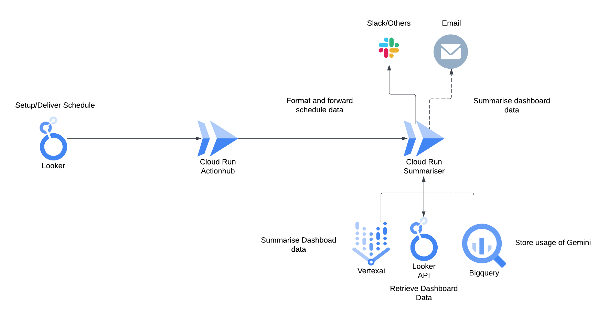

# Looker Summariser Action

The Looker summariser action adds a Summarisation Action to your Looker Schedule Delivery. Once a schedule is setup, you can send summaries of your schedule to Google Chat or others. The summaries themselves are created using the Looker API and Gemini. These extract info from each tile and creates a summary of it.

## Design
The Looker Summariser contains 2 major parts: The Summariser Action with Hub and the Summariser Cloud Function. The Summariser action itself is contained within an Action hub and can also be added easily to your own Action Hub if you already have set up one. Otherwise this guide will help set you up with a Hub easily.
The Hub is hosted on Cloud Run itself, which is open to all traffic. Although it requires a secret hashed key to be accessed. This key can be filled in Looker to access the Cloud Run instance.
The Summariser itself is situated in Cloud Run Functions where the Schedule is received and then data is retrieved from the Looker API. This data is then fed to Gemini which creates a summary using a preset prompt. This prompt can be adjusted to your needs, in the future it will be possible to personalise the prompt within the action itself.
These parts are all deployed with the help up Terraform and Cloud Build.



## How to setup? (Cloud Build)

1. First setup a Cloud Storage bucket for Terraform so it can save it's state. Copy this name and put it in the `main.tf` file, in the backend area.
2. Cloud Build should now be setup on your repo, make sure that your Repo has the Cloud Build extension. If not then add it to your repo from [here](https://github.com/marketplace/google-cloud-build).

3. Once Cloud Build is setup on your repo, then Cloud Build itself can be set up. Go to Cloud Build on your GCP project and then select the Triggers tab on the left side. Now go to Connect Repository and follow the setup to connect Cloud Build to your repo. Do not set a trigger yet. Once done, we will now create a Trigger itself. Fill in all information to your preference, the only important part is the Configuration. Here make sure that 'Cloud Build configuration file (yaml or json)' is selected under Type and under Location that Repository is selected with '/cloudbuild.yaml' as location. Note that it is recommended to setup a Service Account for Cloud Build, otherwise it will use the standard compute service account. Make sure you have given the following roles to the SA: 
    * Artifact Registry Administrator
    * Cloud Run Admin
    * Create Service Accounts
    * Logs Writer
    * Secret Manager Admin
    * Security Admin
    * Service Account Token Creator
    * Service Account User
    * Storage Admin

4. Now that Cloud Build is setup we can make the first commit! This commit will trigger Cloud Build and it will setup the initial resources. These resources being Artifact Registry and the required Secrets.
5. Cloud Build has now setup the initial parts and the build will fail, since not everything is ready yet. Now we can setup the secrets, go to secret manager and start filling in the 4 required secrets: Action_hub_secret, Cipher_Master, LookerSDK_client_id and LookerSDK_client_secret. Action Hub Secret and Cipher master can be generated using the following command: `openssl rand -hex 32`. Make sure to keep the output for Action_hub_secret around, since we need it later on again. LookerSDK secrets will have to be retrieved by generating API credentials for your user account, how to do this can be found [here](https://cloud.google.com/looker/docs/api-auth#authentication_with_an_sdk).
6. Once the secrets have been filled in, you can rebuild the commit in Cloud Build. Now all resources should deploy normally.
7. Most likely your Looker will start complaining that it requires an authorization key, this is where the action_hub_secret comes in. First export the secret as env variable ``export ACTION_HUB_SECRET=yoursecret``. Afterwards run the Python program ``generate_key.py``, it will output the authorization key that you can use in Looker.
8. Now that Looker sees your action we only have to commit the information we filled in Auto.tfvars and let Cloud Build deploy it. Once that is done, you can create a schedule delivery and start using the action!


## How to run locally for testing?
1. CD into the function folder
2. Setup env.list by copying the following information inside of the file.
```
LOOKERSDK_BASE_URL=<RETRIEVE FROM LOOKER>
PDF_BUCKET=<PDF BUCKET TO STORE DATA>
PROJECT_ID=<PROJECT ID WITH VERTEX ACTIVATED>
LOOKERSDK_CLIENT_ID=<RETRIEVE FROM LOOKER>
LOOKERSDK_CLIENT_SECRET=<RETRIEVE FROM LOOKER>
GOOGLE_APPLICATION_CREDENTIALS=/gcp/creds.json

```
3. Build image by running the following command ``docker build --tag function .``. You can give the container a different tag if needed.
4. Run ``docker run -d -p 5001:5000 -v "$HOME/.config/gcloud/application_default_credentials.json":/gcp/creds.json:ro --env-file ./env.list function``. Another port can be given if needed. Note that the ADC credentials are usually stored in the given folder. If this is different, change the path.
5. The function can now be approached by calling: '0.0.0.0:5001'